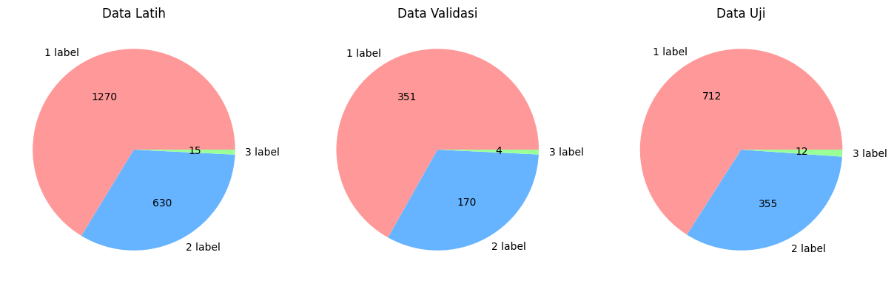
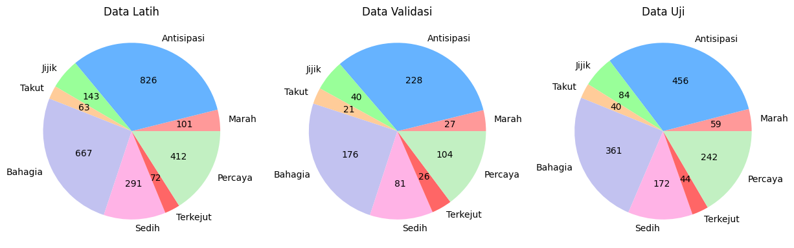

# indonesian-multilabel-emotion-dataset

Indonesian Multi-label Emotion Dataset. The texts were taken from Lin et al's work (https://www.sciencedirect.com/science/article/abs/pii/S0306457322001984) and re-annotated.

The differences between this and the original dataset :

- Re-annotated with a group of annotators that are Indonesian natives
- Removed sarcasm, ambiguous, duplicates, and non-Indonesian texts
- Using emotions from `Plutchik's Wheel of Emotions` as the label set

## General Information

Dataset contains 3519 rows of data and splitted into train/dev/test with 0.55/0.15/0.3 distribution. Each set has the same emotions and label cardinality distribution.

| Dataset | Size |
| ------- | ---- |
| Train   | 1915 |
| Dev     | 525  |
| Test    | 1079 |

### Label Cardinality

Label cardinality : 1.35

| Label Count | Size |
| ----------- | ---- |
| 1 Label     | 2333 |
| 2 Label     | 1155 |
| 3 Label     | 31   |

### Emotion Labels

| Emotion    | Size |
| ---------- | ---- |
| Antisipasi | 1510 |
| Senang     | 1204 |
| Percaya    | 758  |
| Sedih      | 544  |
| Jijik      | 267  |
| Marah      | 187  |
| Terkejut   | 142  |
| Takut      | 124  |

**Emotion Distribution**

